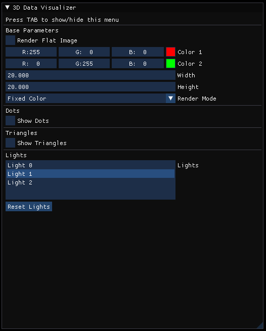

# 3D-Data-Visualizer
3D-Data-Visualizer is a C++ program to render 2D data, stored as a terrain image, in 3D with different visualization methods and shaders.
This program was created to teach the use of GLSL shaders as part of the Computer Science master's degree at TU Delft.

It is built for OpenGL version 4.1.


## Usage

### 1. Default Configuration

The program loads a default configuration stored in the */resources/default_scene.toml* file.
The file has the following format:

```
[data]
path = "resources/Terrains/Mountains-16.png"
render_size = 20.0
render_height = 20.0

[lights]
positions = [[8.0, 5.0, 0.0]]
colors = [[1.0, 1.0, 1.0]]

[camera]
look_at = [0.0, 0.0, -1.0]
rotations = [0.0, 0.0, 0.0]
dist = 10.0

[gradient]
paths = ["resources/ColorMaps/inferno.png",
		 "resources/ColorMaps/magma.png",
		 "resources/ColorMaps/plasma.png",
		 "resources/ColorMaps/rainbow.png",
		 "resources/ColorMaps/viridis.png"]
```

It has a 4 different parts:
 - **[data]**: specifies the path to the terrain image to visualize, along with the default rendering dimensions.
 - **[lights]**: lists all the lights present by default in the scene, by specifying their positions and colors.
 - **[camera]**: defines the initial position of the camera.
 - **[gradient]**: defines a list of color maps available for rendering the terrain.


### 2. User Interface



### 3. Navigation and Keyboard Shortcuts

 - **Camera Movement using the mouse**

| Button  | Action  |
|---|---|
| Left button  | turn in XY  |
| Right Button  | translate in XY  |
| Middle Button  |  move along Z |

 - **Keyboard Shortcuts**

| Key  | Action  |
|---|---|
| TAB  | show/hide menu  |
| H  | show help menu in terminal  |
| L  |  place the selected light source at the current camera position |
| Shift+L  | add an additional light source at the current camera position |
| Down Arrow  |  select next light source |
| Up Arrow  |  select previous light source |
| DEL  |  delete selected light source |
| N  |  clear all light sources and reinitialize with one |
| R  |  add 0.1 to the red channel of the selected light |
| G  |  add 0.1 to the green channel of the selected light |
| B  |  add 0.1 to the blue channel of the selected light |
| Shift+R  |  substract 0.1 from the red channel of the selected light |
| Shift+G  |  substract 0.1 from the green channel of the selected light |
| Shift+B  |  substract 0.1 from the blue channel of the selected light |
